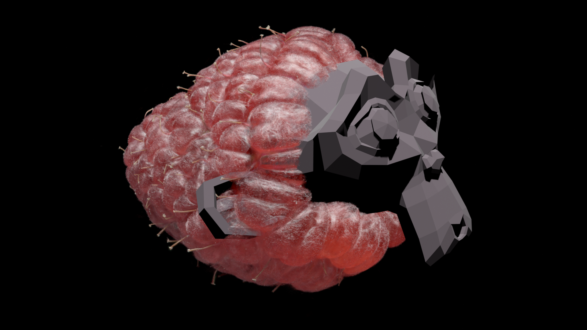

# SplatBake

**Import a Gaussian splat. Bake it. Render it.**

*A Blender add-on by [Blender-Claude](https://github.com/Blender-Claude) and MMJ — free software under GPL-3.0-or-later.*

> **Not affiliated with, sponsored by, or endorsed by Anthropic or the Blender
> Foundation.** "Blender-Claude" is the author's chosen handle, reflecting that
> the add-on was written with the help of Anthropic's Claude. Claude is a
> trademark of Anthropic, PBC; Blender is a trademark of the Blender
> Foundation. Both names are used here only to describe how the project was
> made and what it runs on.

Blender can't render Gaussian splats — they aren't geometry, so Cycles and
EEVEE simply don't see them. SplatBake fixes that in three steps:

1. **Import** a splat file (`.ply`, `.splat`, `.sog`) and see it live in the
   viewport, drawn on the GPU.
2. **Bake** it into real Blender geometry — either soft gaussian discs that
   keep the captured look, or one solid UV-mapped, textured mesh.
3. **Render** with F12 like any other object, or export it as OBJ / glTF /
   FBX / STL.

That's the whole idea. Everything else in the panel is optional tuning.

---

## Example

*Image description: Suzanne (OBJ mesh) inside a Raspberry (3DGS / PLY Gaussian
splat).*

### Credits

3DGS object — Raspberry:

- [Raspberry — SuperSplat](https://superspl.at/scene/04bdd392)
- [www.patreon.com/DanyBittel](https://www.patreon.com/DanyBittel)

---

## Install

Blender 4.2 or newer.

**Edit → Preferences → Get Extensions → Install from Disk…** and pick the zip.
The panel appears in the 3D viewport sidebar (press **N**) under the
**SplatBake** tab.

## Quick start

1. **Import Splat** in the panel, or **File → Import → Gaussian Splat**.
2. Click the model to select it, then move it with Blender's own tools —
   `G` / `R` / `S` — exactly as you would any other object. `Ctrl+C` /
   `Ctrl+V` copy and paste it, and `H` / `Alt+H` hide and unhide it.
3. Press **Max Detail** if you want maximum viewport crispness.
4. Pick a bake:
   - **Bake Discs** — one soft gaussian disc per splat. Closest to the
     captured look. Renders in Cycles and EEVEE with reflections, depth of
     field and motion blur.
   - **Bake Solid Surface** — one watertight mesh, UV-unwrapped and textured.
     Lit by your scene, sculptable, retopologisable, and exportable.
5. **F12.**

If you only want an image and not geometry, **Snapshot Still** captures the
live viewport (splats included) at render resolution — the fastest route to a
picture that matches the viewport exactly.

## Exporting to OBJ, STL, glTF, FBX

Bake **Solid Surface** first — that produces an ordinary Blender mesh, so every
exporter works on it. Then **File → Export**.

One thing worth knowing before you pick a format:

| Format | Geometry | UVs | Texture |
|---|---|---|---|
| OBJ | yes | yes | yes, via the `.mtl` |
| glTF / FBX | yes | yes | yes |
| **STL** | yes | **no** | **no** |

STL stores triangles and nothing else — no UVs, no colour, by design. It's the
right choice for 3D printing or CAD, but the model arrives untextured. Use OBJ
or glTF if you want the colour to travel with the mesh.

For OBJ, tick **Materials** in the export dialog. The baked texture is packed
into the `.blend`; use **File → External Data → Unpack Resources** if you need
it as a loose image file next to the exported model.

## Supported formats

- **`.ply`** — standard 3DGS, with optional spherical harmonics
- **`.splat`** — the compact binary format (no SH)
- **`.sog`** — Spatially Ordered Gaussians, version 2: both the bundled
  single-file `.sog` and the unbundled layout (pick its `meta.json`, or the
  folder containing it). Roughly 15–20× smaller than the equivalent PLY, with
  higher-order SH preserved. SOG is lossy by design — positions are 16-bit,
  orientations 8-bit per component (well under 1° of error), and scales and
  colours are codebook-quantised.
- **Streamed / LOD SOG** (`lod-meta.json` plus `0_0/`, `1_0/` … chunk folders)
  — unzip the download and import its `lod-meta.json`, or point the importer at
  the containing folder. The levels are *additive*: level 0 is the finest and
  each higher index coarser, so the whole scene is every level stacked.
  **Streamed SOG Detail** chooses how many to stack — Full, Medium (drop the
  finest, about half the splats) or Coarse (a fast preview). Chunks are thinned
  to your Max Splats budget as they load, so a scene larger than memory still
  opens.

## The two bakes, in more detail

### Bake Discs — keep the captured look

One emission gaussian disc per splat, kernel-matched to the viewport. Renders
in true F12.

- **Colour Detail** — how much view-dependent colour survives. *Camera View*
  bakes the full spherical harmonics toward the scene camera (exact viewport
  colour for that shot). *Live* evaluates degree-1 SH in the material so colour
  shifts with the render camera. *Base* is flat.
- **Colour as Texture** (default) writes each splat's colour into one texel of
  a float image addressed through its own UV layer — nearest-neighbour and
  Non-Color, so the value reaching the renderer is exactly the one you see.
- Splats over the cap are kept by opacity importance and near-invisible haze
  can be culled, so large scenes stay fast. The cap goes to 4M.
- Cycles gives the cleanest blend (transparent bounces are raised
  automatically). EEVEE uses hashed transparency — raise render samples to hide
  the dither.
- The bake is frozen at the model's current transform and casts no shadows
  (it is baked radiance).

### Bake Solid Surface — a normal mesh

Each splat contributes a blob **sized by its own gaussian**, the density is
sampled on a voxel grid, and the isosurface is extracted — giving one solid
mesh that is lit by your scene and casts shadows.

Three controls decide how closely it follows the splat contour:

- **Match Splat Size (auto detail)** — on by default. Grid resolution depends
  entirely on how big the splats are relative to the scene, so a fixed number
  rarely fits. On one real 1.9M-splat scan the scene spans 363 units while a
  typical splat radius is 0.044: even at detail 400 the voxel is 21× larger
  than a splat, every blob collapses to a single voxel, and the surface simply
  cannot follow the contour. Auto targets about two voxels per splat and picks
  ~4000 for that scan. The status bar reports the voxel size against the splat
  size after every bake.
- **Surface Tightness** — the isosurface level. Low sits far out in each
  splat's falloff (puffier, closes gaps); high hugs the dense core (tighter to
  the real contour, but can open holes in thin areas).
- **Blob Size** — multiplies each splat's own radius. Raise it to close holes
  in a sparse scan, lower it for a leaner surface that follows fine detail.

Splats over the point cap are now kept by opacity importance, so solid
structure survives and haze goes first.

*Generate UV Map* unwraps it (Smart UV Project), and *Bake Colours to Texture*
rasterises the splat colours through that layout into a packed 1K/2K/4K image.
Colour detail is then set by the texture rather than by how dense the mesh is,
and unlike vertex colours a texture survives export. The mesh is also paintable
in Texture Paint mode.

The texture is rasterised directly in numpy — triangles filled by barycentric
interpolation, then padded outward so bilinear filtering can't sample the empty
gutter and draw dark seams along island edges.

## Scene-lit baking (experimental)

By default a baked model is **emission**: it carries the captured lighting and
looks the same whether the scene has lamps or not. Tick **React to Scene Lights
(Experimental)** in the disc-bake dialog and the colour becomes *albedo* on a
diffuse surface instead, so Blender has to light it — black with no lamps and a
black world, lit when a lamp shines on it, casting and receiving shadows.

Each disc spans its splat's two largest covariance axes, so its face normal is
the smallest axis: the standard surface-normal estimate, which is what makes the
lighting read correctly.

**If it looks unlit, check your viewport shading first.** You must be in
**Rendered** shading, or **Material Preview** with *Scene Lights* and *Scene
World* both ticked in the shading dropdown. Material Preview otherwise lights
with its own studio HDRI and ignores your lamps entirely, and Solid shading
shows no materials at all — which looks exactly like the feature not working.

Also worth knowing: a capture already has its lighting baked into the colours,
so using them as albedo multiplies the original lighting by the new lighting.
Keep the added lamps soft.

## Viewport tips

- **Fast Solid-Mode Preview** (on by default) trades fidelity for framerate
  while shading is *Solid* or *Wireframe* — the modes you navigate in. It draws
  a fraction of the splats (**Solid Detail**, 25% by default), skips
  view-dependent colour, and re-sorts less often. *Material Preview* and
  *Rendered* stay at full quality.
- **Max Detail** locks every setting to source-viewer parity for maximum
  crispness: reference kernel, de-spike off (thin anisotropic splats carry
  edges, wires and hair — clamping them rounds fine detail off), AA
  compensation off, full size cap, per-frame sort, full SH. It also switches
  **Fast Solid-Mode Preview off**, since that preview would otherwise override
  those settings the moment you were in Solid shading. Re-tick it whenever you
  want speed back — the Solid Detail slider keeps its value and takes over
  again immediately.
- **Hide / unhide works natively** — `H`, `Alt+H`, the outliner eye and monitor
  icons, hidden or excluded collections and local view all hide the splats along
  with their handle.
- **Clicking selects, nothing more.** A click picks the model under the cursor
  and stops there; transforms always go through Blender's own `G` / `R` / `S`
  and gizmos, so nothing is ever moved by accident. Clicks that miss every
  model behave exactly like stock Blender.
- **`Ctrl+C` / `Ctrl+V` copy and paste models**, including a multi-selection.
  A copy **shares** the original's splat data rather than duplicating it, so
  pasting a 2M-splat scan costs a transform and a mask — not another 2M
  splats — and you can fill a scene with copies for the price of one. Each
  copy still moves, hides and bakes independently. Paste lands in place and
  selects what it made, so `G` moves it straight away. With no splat selected
  (or an empty splat clipboard) both keys fall through to Blender's own
  object copy and paste.

## A note on floaters

Photogrammetric captures often contain a few splats thousands of units from the
scene — sky fragments and reconstruction noise. One real 1.9M-splat scan
measures ~140 units across but has a raw extent of 117,000 because of just 11
strays. The transform handle, the sort pivot and Frame therefore all use
median ± 4·MAD bounds instead of raw min/max, so the handle frames the scene you
can actually see. Use **Trim Outliers %** at import (0.1% is usually plenty) if
you want the strays gone from the data as well.

## Project layout

| Module | Role |
|---|---|
| `loaders.py` | PLY / `.splat` parsing, SH extraction, trim, subsample |
| `sog.py` | SOG v2 reader — bundled, unbundled, streamed |
| `sh.py` | spherical-harmonic evaluation |
| `shaders.py` | GLSL sources and the shader builder |
| `renderer.py` | per-model GPU buffers, depth sort, draw |
| `state.py` | live model list, draw handler, visibility |
| `boxes.py` | proxy Empties driving each model's transform |
| `lighting.py` | scene-lit bake material (self-contained) |
| `uvtools.py` | UV unwrap and colour-to-texture rasteriser (self-contained) |
| `persist.py` | reload recipes, so models survive save/reopen (self-contained) |
| `operators.py` | import, bake, snapshot, edit operators |
| `ui.py` | the N-panel and scene properties |

`lighting.py`, `uvtools.py` and `persist.py` are deliberately standalone, so
the optional features can change without touching the render path.

## Known limitations

Honest list, so nothing comes as a surprise.

**Splat models reload from their source files, so keep those files.** Saving a
`.blend` does not write the splats into it — a multi-million-splat cloud is
hundreds of megabytes, and every save would carry it. Instead each handle
stores a small *recipe*: the source path, the import options, and the rest
transform. Reopen the file and the models come back automatically, a moment
after the window appears.

What this means in practice:

- **Don't move or delete the source file**, or rename the folder it lives in.
  Both a relative and an absolute path are recorded, so moving the whole
  project folder is fine; moving just the splat file is not. If a source has
  gone missing, the system console names it and the rest of the scene still
  loads.
- **Splats you deleted stay deleted.** The alive mask is packed to one bit per
  splat and compressed — on a 1.9M-splat model with 1% deleted that is about
  40 KB, versus 404 MB for the raw splat data.
- **Reopening is as slow as importing was**, since the file is re-read. Loading
  is deferred and staggered so Blender opens promptly rather than freezing.
- **Baked meshes are ordinary geometry** and are saved in the `.blend` as
  normal — they need no source file at all.

**Experimental — React to Scene Lights.** Works, but read the section above
first: if you are not in *Rendered* shading (or *Material Preview* with Scene
Lights **and** Scene World ticked) it will look unlit, which is a viewport
setting rather than a bug. A capture also has its own lighting baked into the
colours, so new lamps multiply with the old ones.

**SOG decoding leans on Blender's own WebP loader.** The maths is verified
against real files, but the pixel read goes through Blender's image system,
which varies by build. If a `.sog` imports as garbage geometry, this is the
first thing to suspect — please report it with your Blender version.

**Streamed SOG does not stream.** There is no camera-distance loading in
Blender, so the levels you choose are simply stacked at import.

**Baked discs are frozen.** A disc bake captures the model's transform at bake
time; move the splats afterwards and the bake stays where it was. Re-bake.

**STL carries no colour.** No UVs, no vertex colours — by format design. Use
OBJ or glTF if the texture needs to travel.

**Large scenes need RAM.** A 6M-splat streamed scene with degree-3 spherical
harmonics is well over a gigabyte before Blender's own overhead. Use the
Max Splats budget and the Streamed SOG Detail options.

**Ctrl+C on a mixed selection** copies the splat models and leaves ordinary
Blender objects to Blender's own clipboard; the two do not merge into one
paste. Copy them in separate passes.

## Reporting a bug

Bug reports are welcome. Please include:

1. **Blender version**, OS, and GPU.
2. **The add-on version** (shown in the panel header and in Preferences).
3. **What you did**, and what you expected instead.
4. **The traceback from the system console** — this is the single most useful
   thing you can send. *Window → Toggle System Console* on Windows, or launch
   Blender from a terminal on macOS/Linux. Many operations print the real
   cause there even when the status bar shows only a short message.
5. **The file**, if it is a loading problem and you are able to share it — and
   its format (`.ply`, `.splat`, `.sog`, streamed `lod-meta.json`).

For import problems, it also helps a lot to say which tool exported the file.

## Acknowledgements

**Anthropic**, for Claude — which wrote a great deal of this add-on: the SOG
reader, the bake paths, the UV rasteriser, and the several hundred tests that
kept them honest. Anthropic neither sponsors, endorses, nor supports this
project, and has no responsibility for it. The gratitude is entirely
one-directional, and entirely sincere.

**The Blender Foundation**, for a 3D suite whose Python API is open enough
that a splat renderer can simply be *added* to it, and whose GPL licence this
project is proud to inherit.

**The 3D Gaussian Splatting research community**, for the technique itself,
and everyone who published an open format spec — without one, an importer is
just guesswork.

**The capture authors**, whose CC-BY scenes made testing against real data
possible rather than theoretical. Their names travel with their scenes; please
keep them there.

## Authors and license

Written by **Blender-Claude and MMJ** — a human with initials and a language
model with opinions about depth sorting.

`MMJ` is the human author: the one who decided what this should be, said no
when it wandered, and tested every build against real scans on real hardware.
`Blender-Claude` is the handle under which the work was done with Claude's
help. Between them, roughly forty builds, five test suites, and one memorable
afternoon spent discovering that eleven stray splats can make a scene appear
117,000 units wide.

Home: <https://github.com/Blender-Claude>
Copyright rests with the human author. See the trademark note above.

    SplatBake
    Copyright (C) 2026 Blender-Claude and MMJ

    This program is free software: you can redistribute it and/or modify it
    under the terms of the GNU General Public License as published by the
    Free Software Foundation, either version 3 of the License, or (at your
    option) any later version.

Released under **GPL-3.0-or-later** — see `LICENSE.md` for the full notice.
Blender's Python API is GPL, so add-ons that import `bpy` must ship under a
GPL-compatible license; this isn't merely a preference.

Splat scenes you import carry **their own** licenses. Many public captures are
CC-BY and require crediting the original author in anything you publish.
